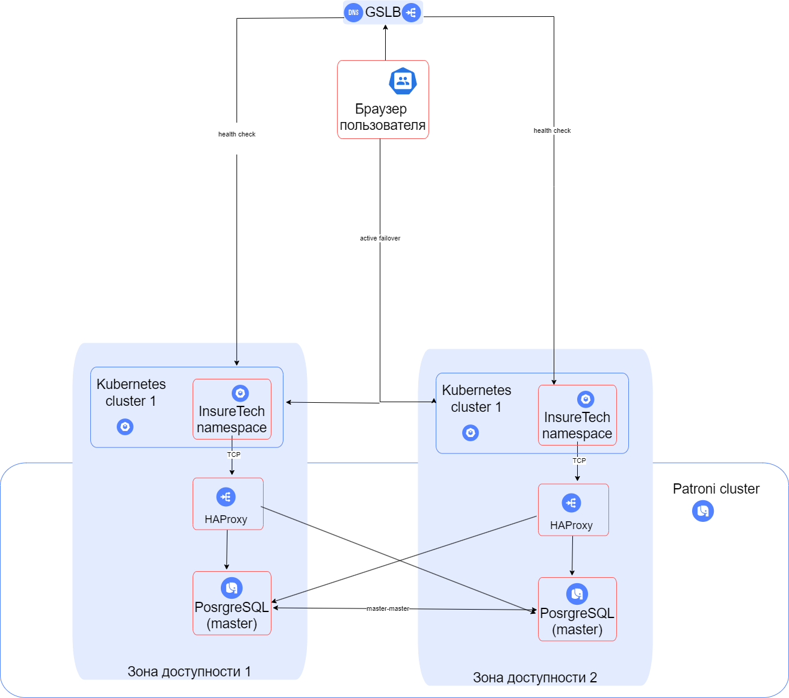

# диаграмма

# Определите стратегию масштабирования и отказоустойчивости.

1. Для масштабирования и отказоустойчивости будет использоваться стратегия active-active с 2мя зонами доступности.
2. 
        a) Каждый кластер k8s - независим. Внутри настроено горизонтальное масштабирование подов. Это повысит надежность и соответствует требованиям
        высокой доступности.
        
        b) Для балансировки нагрузки будет использоваться GSLB, который обеспечит распределение трафика между гео распределенными кластерами.
        
        c) Active-Active подходит под задачи нашей системы для обеспечения отказоустойчивости, а так-же для скорости доступа из разных регионов.
        
        d)  В двух зонах доступности будет единый кластер БД управляемый Patroni с несколькими master. 
3. С данными нагрузками шардирование на данном этапе - излишне. В будущем при увеличении нагрузки и количества клиентов
можно будет настроить шардирование по региону клиента

